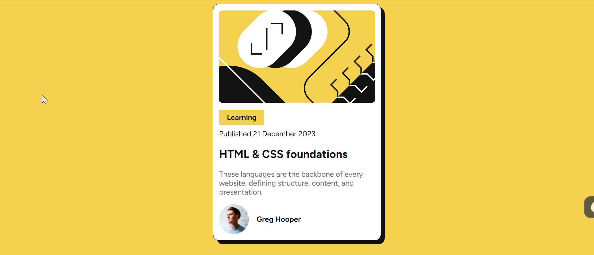

# Frontend Mentor - Blog preview card solution

This is a solution to the [Blog preview card challenge on Frontend Mentor](https://www.frontendmentor.io/challenges/blog-preview-card-ckPaj01IcS).

## Table of contents

- [Overview](#overview)
  - [The challenge](#the-challenge)
  - [Screenshot](#screenshot)
  - [Links](#links)
- [My process](#my-process)
  - [Built with](#built-with)
  - [What I learned](#what-i-learned)
  - [Continued development](#continued-development)
  - [Useful resources](#useful-resources)
- [Author](#author)

## Overview

### The challenge

Users should be able to:

- See hover and focus states for all interactive elements on the page

### Screenshot



### Links

- Solution URL: [Github link](https://github.com/snigdha-sukun/blog-preview-card)
- Live Site URL: [Blog preview card](https://blog-preview-card-seven-coral.vercel.app/)

## My process

### Built with

- Semantic HTML5 markup
- CSS custom properties

### What I learned

I learned how to use custom font files

```css
@font-face {
    font-family: 'Figtree';
    src: url("./assets/fonts/Figtree-VariableFont_wght.ttf") format('truetype');
}
```

I learned how to add border & box shadow
```css
.box {
    border: 1px solid hsl(0, 0%, 7%);
    box-shadow: 8px 8px;
}
```

I learned how to makwe the div width same as h1

```css
.box {
    display: block;
    width: fit-content;
}

p {
  width: 0;
  min-width: 100%;
}
```

I learned that setting `min-height` is important to align items vertically
```css
body {
    display: flex;
    justify-content: center;
    align-items: center;
    box-sizing: border-box;
    min-height: 90vh;
}
```

### Continued development

I still need to practice the positioning an element more. I also need to learn about CSS in general & HTML5 rules.

### Useful resources

- [W3 School](https://www.w3schools.com/cssref/index.php) - Best resource to refer for any CSS related queries
- [MDN Mozilla](https://developer.mozilla.org/en-US/docs/Web/CSS) - Also a good site to refer for CSS

## Author

- Frontend Mentor - [@snigdha-sukun](https://www.frontendmentor.io/profile/snigdha-sukun)
